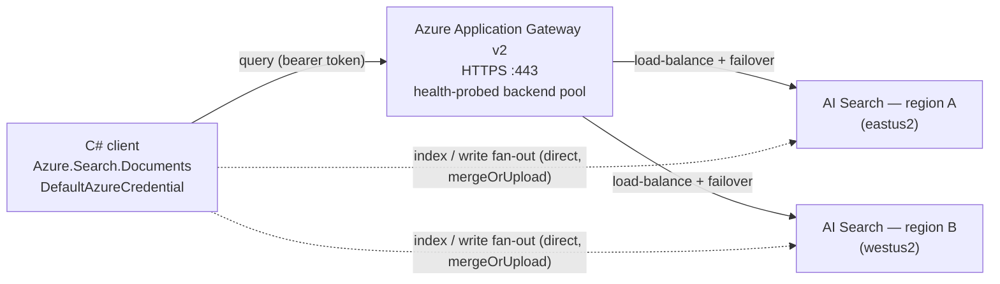

# Consuming Azure AI Search across multiple regions via Application Gateway

This sample shows how a **C# / .NET** client consumes **Azure AI Search** deployed in **two or
more regions**, using an **Azure Application Gateway** as the single entry point for queries.

- **Reads** go through the Application Gateway, which load-balances across the regional search
  services and **fails over automatically** when a region's health probe fails.
- **Writes** fan out **directly** to every region (a load balancer delivers each request to a
  single backend, so the client replicates documents itself with `mergeOrUpload`).
- **Auth** is **Microsoft Entra ID (RBAC)** — one bearer token is accepted by every region, which
  is what makes a shared gateway endpoint possible (per-service API keys cannot be shared).

## Architecture



The Application Gateway is a **regional** resource. It fronts search services in multiple regions
for load balancing and failover. For globally distributed *entry points*, put an Application
Gateway in each region behind **Azure Front Door** — the consumption pattern below is unchanged.

## Repository layout

| Path | Purpose |
| --- | --- |
| `infra/main.bicep` | Orchestrates the search services + gateway + RBAC |
| `infra/modules/search.bicep` | One AI Search service + data-plane role assignments |
| `infra/modules/appgateway.bicep` | VNet, public IP and Application Gateway v2 |
| `src/MultiRegionSearch/` | The .NET console client (`init`, `seed`, `query`, `bench`, …) |
| `src/MultiRegionSearch.Tests/` | xUnit unit tests for `SyncAnalyzer`, `LatencyCalculator`, `Product`, `SampleData`, and `Config` |
| `deploy.ps1` | Generates the cert, deploys infra, writes `appsettings.json` |

## Prerequisites

- [Azure CLI](https://learn.microsoft.com/cli/azure/install-azure-cli) — run `az login`
- [.NET 8 SDK](https://dotnet.microsoft.com/download)
- PowerShell 7+ (the deploy script uses `New-SelfSignedCertificate`)
- **Owner** or **User Access Administrator** on the target resource group (the Bicep creates
  role assignments)

## Deploy

Two deployment paths are available. Both end up with the same infrastructure and a populated
`appsettings.json`. Use **azd** for a repeatable, environment-scoped workflow; use `deploy.ps1`
for a quick one-shot deploy with the Azure CLI only.

### Option A — Azure Developer CLI (azd)

`azd` automates the full lifecycle through hooks wired in `azure.yaml`:

| Hook | Script | What it does |
|---|---|---|
| `preprovision` | `scripts/preprovision.ps1` | Derives a stable name prefix from the env name, generates a self-signed TLS certificate, and stores all secrets in the azd environment. Skips cert regeneration on re-runs. |
| `postprovision` | `scripts/postprovision.ps1` | Reads the Bicep outputs (`gatewayUrl`, `searchEndpoints`) and writes `src/MultiRegionSearch/appsettings.json`. |

#### Prerequisites

- [Azure Developer CLI](https://learn.microsoft.com/azure/developer/azure-developer-cli/install-azd) ≥ 1.9
- PowerShell 7+ (`pwsh`) — required by the provision hooks
- Owner or User Access Administrator on the target subscription/resource group

#### Steps

```powershell
# 1. Sign in
azd auth login

# 2. Create a new environment (sets AZURE_ENV_NAME — used to derive the resource name prefix)
azd env new <env-name>          # e.g. azd env new dev

# 3. Set the region for the Application Gateway (required)
azd env set AZURE_LOCATION eastus2

# 4. (Optional) Change which regions get a search service.
#    Edit infra/main.parameters.json → searchRegions before running provision.
#    Default: ["eastus", "westus2"]

# 5. Provision all infrastructure (~6-8 minutes for Application Gateway)
azd provision
```

`azd provision` will:
1. Run **preprovision.ps1** — generates the self-signed PFX cert, derives `NAME_PREFIX` /
   `DNS_LABEL` from the environment name, defaults `AZURE_PRINCIPAL_TYPE` to `User`.
2. Deploy the Bicep template (`infra/main.bicep`) — search services + Application Gateway +
   VNet + RBAC role assignments.
3. Run **postprovision.ps1** — writes `src/MultiRegionSearch/appsettings.json` with the live
   gateway URL and regional endpoints from the deployment outputs.

> **RBAC propagation** takes 1–2 minutes after provisioning completes. Wait before running
> the app for the first time.

#### Re-runs and updates

`azd provision` is idempotent. Running it again after changing `searchRegions` in
`main.parameters.json` adds new regional services without touching existing ones.
The post-provision hook rewrites `appsettings.json` automatically.

#### Tear down

```powershell
azd down
```

#### Pipeline / service-principal deploys

```powershell
azd env set AZURE_PRINCIPAL_TYPE ServicePrincipal
azd env set AZURE_PRINCIPAL_ID   <sp-object-id>
azd provision
```

---

### Option B — deploy.ps1 (Azure CLI)

A self-contained PowerShell script that performs the same steps without azd:

```powershell
./deploy.ps1 -ResourceGroup rg-aisearch-multiregion -Location eastus2 -SearchRegions eastus2,westus2
```

The script:

1. Resolves your signed-in object ID and grants it `Search Service Contributor`,
   `Search Index Data Contributor` and `Search Index Data Reader` on **every** search service.
2. Generates a self-signed certificate for the gateway's HTTPS listener.
3. Deploys the infrastructure (Application Gateway provisioning takes ~6–8 minutes).
4. Writes `src/MultiRegionSearch/appsettings.json` from the deployment outputs.

> RBAC assignments take 1–2 minutes to propagate. Wait before running the app.

## Unit tests

The test project runs fully offline — no Azure credentials or deployed resources are required.

```powershell
dotnet test src/MultiRegionSearch.Tests/MultiRegionSearch.Tests.csproj
```

| Test class | What it covers |
| --- | --- |
| `SyncAnalyzerTests` | Cross-region document parity: missing docs, per-field drift, multi-region scenarios, issue sort order |
| `LatencyStatsTests` | P50/P95 percentile index math, empty input, single-element, all-same-values edge cases |
| `ProductTests` | `Product` model defaults and settable properties |
| `SampleDataTests` | Built-in sample dataset: count, unique IDs, non-empty fields, valid price/rating ranges, expected categories |
| `ConfigTests` | `SearchConfig`, `GatewayConfig.IsConfigured` guard, `RegionConfig` defaults |

## Run

```powershell
cd src/MultiRegionSearch

dotnet run -- demo          # init + seed + a gateway query + per-region status
```

Individual commands:

```powershell
dotnet run -- init                       # create the index in every region
dotnet run -- seed                       # fan out sample documents to every region
dotnet run -- query "wireless"           # query THROUGH the Application Gateway
dotnet run -- query-direct westus2 "coffee"   # query a single region directly
dotnet run -- status                     # document count per region
dotnet run -- bench 100                  # 100 sequential queries, latency stats
dotnet run -- bench 200 8               # 200 queries at concurrency 8 (measures under real load)
dotnet run -- sync-check                # compare document sets across all regions
```

## Smoke-test after deployment

`scripts/test-appgw.ps1` is a self-contained validation script that runs 12 checks and reports
pass/fail for each:

| Section | What it validates |
| --- | --- |
| **Auth** | `az account get-access-token` returns a token for `https://search.azure.com` |
| **1. AppGW reachability** | HTTPS connection + HTTP 200 from the gateway |
| **2. Backend health probes** | `/ping` responds 200 on each regional endpoint (the same path AppGW probes) |
| **3. Search pass-through** | 6 different search terms routed through AppGW return results |
| **4. Load test** | Configurable N queries measure min / p50 / p95 / max latency |
| **5. Count parity** | Every region returns the same document count |

```powershell
cd scripts
.\test-appgw.ps1                         # defaults: 20 queries, search term "*"
.\test-appgw.ps1 -Queries 100 -SearchTerm "laptop"
```

The script reads `src/MultiRegionSearch/appsettings.json` written by the deploy step, so run it
after `azd provision` (or `deploy.ps1`) has completed.

## Demonstrating failover

1. Seed both regions and confirm parity:

   ```powershell
   dotnet run -- seed
   dotnet run -- status
   ```

2. Start a sustained load through the gateway:

   ```powershell
   dotnet run -- bench 500 8
   ```

3. While it runs, take one region offline — for example disable public network access:

   ```powershell
   az search service update -g rg-aisearch-multiregion -n <one-search-service-name> --public-network-access disabled
   ```

   The gateway health probe marks that backend unhealthy and routes all traffic to the remaining
   region. `bench` keeps reporting **0 failed** because the second region serves the same data.

4. Restore it:

   ```powershell
   az search service update -g rg-aisearch-multiregion -n <one-search-service-name> --public-network-access enabled
   ```

## How it works

- **One token, many regions.** Each search service is created with `authOptions.aadOrApiKey`, so a
  single Microsoft Entra token (audience `https://search.azure.com`) is accepted by all of them.
  This is what lets a shared gateway forward the client's token to any backend.
- **Gateway = reads only.** The Application Gateway backend pool sends each request to one healthy
  member. That is perfect for queries but cannot fan a write out to every region — so the client
  writes to each region directly with `@search.action: mergeOrUpload`, which is idempotent.
- **Host header.** The gateway's HTTP settings use *pick host name from backend address*, so each
  request is forwarded with `Host: <service>.search.windows.net` and the correct SNI.
- **Health probe.** The Application Gateway probes `/ping` on each AI Search backend, which
  returns `200` unauthenticated — a clean liveness signal. Only a region that stops responding
  is removed from rotation.

## Security & production notes

- The demo uses a **self-signed certificate** on the gateway and the client sets
  `Gateway.AllowSelfSignedCert = true` (it bypasses TLS validation). For production, use a real
  certificate / custom domain and set this to `false`.
- Add an **Application Gateway WAF v2** SKU + Front Door for internet-facing workloads.
- Tighten data-plane RBAC to least privilege (a query-only app needs only
  `Search Index Data Reader`).
- For private connectivity, switch the search services to **private endpoints** and reach them from
  the gateway's VNet instead of the public endpoint.

## Clean up

```powershell
az group delete -n rg-aisearch-multiregion --yes --no-wait
```

> Cost note: Application Gateway Standard_v2 plus two Basic search services bill per hour. Delete
> the resource group when you are done.
