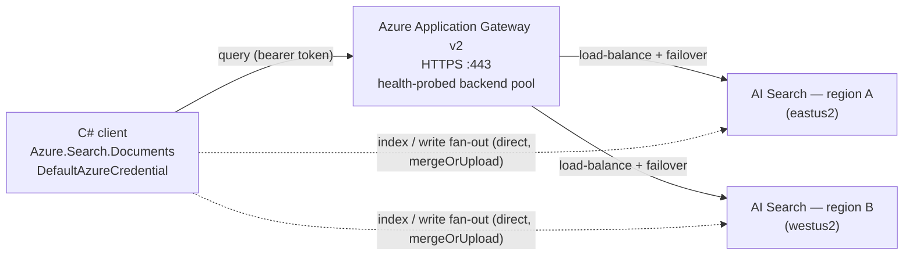

# Consuming Azure AI Search across multiple regions via Application Gateway

This sample shows how a **C# / .NET** client consumes **Azure AI Search** deployed in **two or
more regions**, using an **Azure Application Gateway** as the single entry point for queries.

- **Reads** go through the Application Gateway, which load-balances across the regional search
  services and **fails over automatically** when a region's health probe fails.
- **Writes** fan out **directly** to every region (a load balancer delivers each request to a
  single backend, so the client replicates documents itself with `mergeOrUpload`).
- **Auth** is **Microsoft Entra ID (RBAC)** — one bearer token is accepted by every region, which
  is what makes a shared gateway endpoint possible (per-service API keys cannot be shared).

## Architecture


```mermaid
flowchart LR
  Client["C# client<br/>Azure.Search.Documents<br/>DefaultAzureCredential"]

  AGW["Azure Application Gateway v2<br/>HTTPS :443<br/>health-probed backend pool"]

  S1["AI Search — region A<br/>(eastus2)"]
  S2["AI Search — region B<br/>(westus2)"]

  Client -- "query (bearer token)" --> AGW
  AGW -- "load-balance + failover" --> S1
  AGW -- "load-balance + failover" --> S2

  Client -. "index / write fan-out (direct, mergeOrUpload)" .-> S1
  Client -. "index / write fan-out (direct, mergeOrUpload)" .-> S2
```

The Application Gateway is a **regional** resource. It fronts search services in multiple regions
for load balancing and failover. For globally distributed *entry points*, put an Application
Gateway in each region behind **Azure Front Door** — the consumption pattern below is unchanged.

## Repository layout

| Path | Purpose |
| --- | --- |
| `infra/main.bicep` | Orchestrates the search services + gateway + RBAC |
| `infra/modules/search.bicep` | One AI Search service + data-plane role assignments |
| `infra/modules/appgateway.bicep` | VNet, public IP and Application Gateway v2 |
| `src/MultiRegionSearch/` | The .NET console client (`init`, `seed`, `query`, `bench`, …) |
| `src/MultiRegionSearch.Tests/` | xUnit unit tests for `SyncAnalyzer`, `LatencyCalculator`, `Product`, `SampleData`, and `Config` |
| `deploy.ps1` | Generates the cert, deploys infra, writes `appsettings.json` |

## Prerequisites

- [Azure CLI](https://learn.microsoft.com/cli/azure/install-azure-cli) — run `az login`
- [.NET 8 SDK](https://dotnet.microsoft.com/download)
- PowerShell 7+ (`deploy.ps1` requires Windows to generate a demo certificate;
  `azd` supports Windows, Linux, and macOS)
- **Owner** or **User Access Administrator** on the target resource group (the Bicep creates
  role assignments)

## Deploy

Two deployment paths are available. Both end up with the same infrastructure and a populated
`appsettings.json`. Use **azd** for a repeatable, environment-scoped workflow; use `deploy.ps1`
for a quick one-shot deploy with the Azure CLI only.

### Option A — Azure Developer CLI (azd)

`azd` automates the full lifecycle through hooks wired in `azure.yaml`:

| Hook | Script | What it does |
|---|---|---|
| `preprovision` | `scripts/preprovision.ps1` | Derives a stable name prefix from the env name, generates a self-signed TLS certificate, and stores all secrets in the azd environment. Skips cert regeneration on re-runs. |
| `postprovision` | `scripts/postprovision.ps1` | Reads the Bicep outputs (`gatewayUrl`, `searchEndpoints`) and writes `src/MultiRegionSearch/appsettings.json`. |

#### Prerequisites

- [Azure Developer CLI](https://learn.microsoft.com/azure/developer/azure-developer-cli/install-azd) ≥ 1.9
- PowerShell 7+ (`pwsh`) — required by the provision hooks
- Owner or User Access Administrator on the target subscription/resource group

#### Steps

```powershell
# 1. Sign in
azd auth login

# 2. Create a new environment (sets AZURE_ENV_NAME — used to derive the resource name prefix)
azd env new <env-name>          # e.g. azd env new dev

# 3. Set the region for the Application Gateway (required)
azd env set AZURE_LOCATION eastus2

# 4. (Optional) Change which regions get a search service.
#    Edit infra/main.parameters.json → searchRegions before running provision.
#    Default: ["eastus", "westus2"]

# Demo only: explicitly allow the generated self-signed gateway certificate.
# Omit this for trusted certificates; TLS validation is enabled by default.
azd env set ALLOW_SELF_SIGNED_CERT true

# 5. Provision all infrastructure (~6-8 minutes for Application Gateway)
azd provision
```

`azd provision` will:
1. Run **preprovision.ps1** — generates the self-signed PFX cert, derives `NAME_PREFIX` /
   `DNS_LABEL` from the environment name, defaults `AZURE_PRINCIPAL_TYPE` to `User`.
2. Deploy the Bicep template (`infra/main.bicep`) — search services + Application Gateway +
   VNet + RBAC role assignments.
3. Run **postprovision.ps1** — writes `src/MultiRegionSearch/appsettings.json` with the live
   gateway URL and regional endpoints from the deployment outputs.

> **RBAC propagation** takes 1–2 minutes after provisioning completes. Wait before running
> the app for the first time.

#### Re-runs and updates

`azd provision` is idempotent. Running it again after changing `searchRegions` in
`main.parameters.json` adds new regional services without touching existing ones.
The post-provision hook rewrites `appsettings.json` automatically.

#### Tear down

```powershell
azd down
```

#### Pipeline / service-principal deploys

```powershell
azd env set AZURE_PRINCIPAL_TYPE ServicePrincipal
azd env set AZURE_PRINCIPAL_ID   <sp-object-id>
azd provision
```

---

### Option B — deploy.ps1 (Azure CLI)

A self-contained PowerShell script that performs the same steps without azd:

```powershell
./deploy.ps1 -ResourceGroup rg-aisearch-multiregion -Location eastus2 -SearchRegions eastus2,westus2 -AllowSelfSignedCert
```

The script:

1. Resolves your signed-in object ID and grants it `Search Service Contributor`,
   `Search Index Data Contributor` and `Search Index Data Reader` on **every** search service.
2. Generates a self-signed certificate for the gateway's HTTPS listener.
3. Deploys the infrastructure (Application Gateway provisioning takes ~6–8 minutes).
4. Writes `src/MultiRegionSearch/appsettings.json` from the deployment outputs.

The TLS bypass is **explicitly opt-in**, never enabled by default. For a trusted certificate,
provide `-CertificatePath`, `-CertificatePassword` (a `SecureString`), and
`-GatewayHostName` matching the certificate; omit `-AllowSelfSignedCert`. Point that hostname
to the gateway public IP's DNS name. With azd, set `GATEWAY_HOST_NAME`, `SSL_CERT_DATA`
(base64 PFX), and `SSL_CERT_PASSWORD` before provisioning, and leave
`ALLOW_SELF_SIGNED_CERT` unset or `false`. Protect the azd environment as secret material.

> RBAC assignments take 1–2 minutes to propagate. Wait before running the app.

## Unit tests

The test project runs fully offline — no Azure credentials or deployed resources are required.

```powershell
dotnet test src/MultiRegionSearch.Tests/MultiRegionSearch.Tests.csproj
```

| Test class | What it covers |
| --- | --- |
| `SyncAnalyzerTests` | Cross-region document parity: missing docs, per-field drift, multi-region scenarios, issue sort order |
| `CommandTests` | Actual command orchestration, unavailable regions, failure exit codes, input validation, cancellation, readiness, and replication replay |
| `LatencyStatsTests` | P50/P95 percentile index math, empty input, single-element, all-same-values edge cases |
| `ProductTests` | `Product` model defaults and settable properties |
| `SampleDataTests` | Built-in sample dataset: count, unique IDs, non-empty fields, valid price/rating ranges, expected categories |
| `ConfigTests` | `SearchConfig`, `GatewayConfig.IsConfigured` guard, `RegionConfig` defaults |

### CI and live integration tests

Pull requests run offline unit tests, compile the integration project, and compile the Bicep
deployment. They never receive Azure credentials. Live tests run only on pushes to `master`
when the repository variable `AZURE_INTEGRATION_ENABLED` is `true`.

Configure these repository variables for a **dedicated test environment**:

| Variables | Purpose |
| --- | --- |
| `AZURE_CLIENT_ID`, `AZURE_TENANT_ID`, `AZURE_SUBSCRIPTION_ID` | Federated Azure login; no client secret |
| `AZURE_SEARCH_REGION_1_NAME`, `AZURE_SEARCH_REGION_1_ENDPOINT` | First real regional service |
| `AZURE_SEARCH_REGION_2_NAME`, `AZURE_SEARCH_REGION_2_ENDPOINT` | Second distinct regional service |
| `AZURE_SEARCH_GATEWAY_URL` | HTTPS gateway or Front Door query endpoint |
| `AZURE_SEARCH_GATEWAY_ALLOW_SELF_SIGNED_CERT` | Optional explicit demo bypass; defaults to `false` |

Create an Entra federated identity credential trusting this repository's `master` branch
(`repo:<owner>/<repo>:ref:refs/heads/master`, audience `api://AzureADTokenExchange`).
Grant that test identity index-management and document-write permissions on **only the test
services**. GitHub's OIDC login is used through `DefaultAzureCredential`'s Azure CLI credential.
No Azure client secret is needed or passed to pull-request code.

Enabled live runs reject missing/invalid endpoints instead of silently skipping tests.
Locally, set `AZURE_INTEGRATION_REQUIRED=true` to enforce the same requirement; otherwise the
unconfigured integration suite skips Azure-dependent tests. Each run creates a unique
`products-it-<guid>` index, polls for exact sample content, and removes its indexes on cleanup.
Cleanup failures are reported with the index and region so an operator can remove leftovers.

## Run

```powershell
cd src/MultiRegionSearch

dotnet run -- demo          # init + seed + a gateway query + per-region status
```

Individual commands:

```powershell
dotnet run -- init                       # create the index in every region
dotnet run -- seed                       # fan out sample documents to every region
dotnet run -- replay                     # retry unacknowledged writes from the durable journal
dotnet run -- query "wireless"           # query THROUGH the Application Gateway
dotnet run -- query-direct westus2 "coffee"   # query a single region directly
dotnet run -- status                     # document count per region
dotnet run -- bench 100 1                # 100 sequential queries, latency stats
dotnet run -- bench 200 8               # 200 queries at concurrency 8 (measures under real load)
dotnet run -- sync-check                # compare document sets across all regions
dotnet run -- status --json             # structured JSON lines for automation
dotnet run -- query "*" --config /absolute/path/to/appsettings.json
```

`help`, `--help`, and `-h` work without configuration or Azure credentials. All commands accept
`--config <path>` and `--json`; configuration can also come from `Search__...` environment
variables. HTTPS origins, distinct region names/endpoints, index names, and benchmark bounds
(1–100,000 requests, 1–256 workers) are validated before making requests.

Exit codes are **0** for success, **1** for operational failure/drift/unavailable regions,
**2** for invalid arguments/configuration, and **130** for cancellation (Ctrl+C). `sync-check`
requires at least two regions and reports **INCONCLUSIVE**, not synchronized, if any regional
read fails. `bench` includes throughput and separate successful/failed request latency statistics.
`demo` polls for the seeded documents to become visible rather than waiting a fixed delay;
`Search.ReadinessTimeoutSeconds` defaults to 60 and `ReadinessPollIntervalMilliseconds` to 500.

### Replication and recovery

`seed` saves an immutable document batch before sending it, then checkpoints acknowledgments
per document and region. `replay` retries only unacknowledged writes, including ambiguous writes
interrupted before acknowledgment was persisted. A pending batch blocks new `seed`/`demo` batches, keeping client-initiated batches ordered
within the same journal. This is not server-side fencing: an older request still executing
after a timeout can arrive late.

`Search.ReplicationJournalPath` defaults to `replication-journal.json` in the working directory.
Use a stable absolute path on a persistent local volume for automation; all writers must use
the **same journal**. Protect the file and its directory: they contain document payloads.
The journal uses an exclusive writer lock, flushed writes and same-directory atomic replacement.
Do not delete the journal or lock file to bypass a pending batch. Replay against the original
index and endpoints; after a completed batch, archive the journal before changing destinations.

This is **at-least-once, eventually consistent** replication, not a cross-region transaction.
An acknowledged indexing request does not mean the documents are already queryable.
Use readiness checks and `sync-check` to verify visibility and parity. Reconciliation only
replays the recorded batch; it does not automatically delete unexpected documents or select a
winner for changes made outside this writer.

The journal's sequence versions batches locally; it is not a server-enforced document version.
For distributed production ingestion, use a durable queue/outbox and independent regional
consumers, ordered per-document versions (including deletes), checkpoints and dead-letter
handling. Separate journals or external writers are **not** coordinated by this sample.
Protect the volume with appropriate access controls/backups; local journaling alone is not
protection against disk loss or a distributed delivery service.

## Smoke-test after deployment

`scripts/test-appgw.ps1` is a self-contained validation script that runs checks and reports
pass/fail for each:

| Section | What it validates |
| --- | --- |
| **Auth** | `az account get-access-token` returns a token for `https://search.azure.com` |
| **1. AppGW reachability** | HTTPS connection + HTTP 200 from the gateway |
| **2. Backend health probes** | `/ping` responds 200 on each regional endpoint (the same path AppGW probes) |
| **3. Search pass-through** | 6 different search terms routed through AppGW return results |
| **4. Load test** | Configurable N queries measure min / p50 / p95 / max latency |
| **5. Count parity** | Every region returns the same document count |

```powershell
cd scripts
.\test-appgw.ps1                         # defaults: 20 queries, search term "*"
.\test-appgw.ps1 -Queries 100 -SearchTerm "laptop"
# Only when testing a self-signed demo gateway:
.\test-appgw.ps1 -SkipSslValidation
```

The script reads `src/MultiRegionSearch/appsettings.json` written by the deploy step, so run it
after `azd provision` (or `deploy.ps1`) has completed.

## Demonstrating failover

1. Seed both regions and confirm parity:

   ```powershell
   dotnet run -- seed
   dotnet run -- status
   ```

2. Start a sustained load through the gateway:

   ```powershell
   dotnet run -- bench 500 8
   ```

3. While it runs, take one region offline — for example disable public network access:

   ```powershell
   az search service update -g rg-aisearch-multiregion -n <one-search-service-name> --public-network-access disabled
   ```

   After its health probes detect the outage, the gateway routes traffic to the remaining
   region. Requests can fail during detection and retry windows; `bench` reports those failures.
   Measure recovery instead of assuming zero errors. This manual procedure tests a search
   backend outage, not loss of the gateway's region; use only a disposable environment.

4. Restore it:

   ```powershell
   az search service update -g rg-aisearch-multiregion -n <one-search-service-name> --public-network-access enabled
   ```

## How it works

- **One token, many regions.** Each search service supports Microsoft Entra authentication, so a
  single Microsoft Entra token (audience `https://search.azure.com`) is accepted by all of them.
  This is what lets a shared gateway forward the client's token to any backend.
- **Gateway = reads only.** The Application Gateway backend pool sends each request to one healthy
  member. That is perfect for queries but cannot fan a write out to every region — so the client
  writes to each region directly with `@search.action: mergeOrUpload`, which is idempotent.
- **Host header.** The gateway's HTTP settings use *pick host name from backend address*, so each
  request is forwarded with `Host: <service>.search.windows.net` and the correct SNI.
- **Health probe.** The Application Gateway probes `/ping` on each AI Search backend, which
  returns `200` unauthenticated — a clean liveness signal. Only a region that stops responding
  is removed from rotation.

## Security & production notes

- The demo can use a **self-signed certificate** on the gateway. TLS validation is enabled
  by default; `Gateway.AllowSelfSignedCert = true` explicitly bypasses validation **only for
  the gateway client**. For production, use a trusted certificate / custom domain and leave
  this setting `false`. The smoke-test script requires its own `-SkipSslValidation` opt-in.
- Add an **Application Gateway WAF v2** SKU + Front Door for internet-facing workloads.
- Tighten data-plane RBAC to least privilege (a query-only app needs only
  `Search Index Data Reader`).
- For private connectivity, switch the search services to **private endpoints** and reach them from
  the gateway's VNet instead of the public endpoint.

### Optional infrastructure profiles

The single-gateway public-endpoint demo remains the default. Advanced profiles are configured
with parameters to `infra/main.bicep` (supply them to `az deployment group create`, or add them
to `infra/main.parameters.json` for azd):

| Parameters | Behavior |
| --- | --- |
| `queryPrincipalId`, `queryPrincipalType` | Query identity receives only `Search Index Data Reader` |
| `indexingPrincipalId`, `indexingPrincipalType` | Writer receives document contributor and index-management roles |
| `disableLocalAuth` | Defaults to `true`; API keys are disabled unless explicitly re-enabled |
| `gatewayHostName` | Optional single-gateway custom DNS hostname matching the trusted listener certificate |
| `searchReplicaCount`, `searchPartitionCount` | Capacity per service; choose for your SKU, availability requirements and cost |
| `enablePrivateEndpoints` | Disables public Search access; creates private endpoints and private DNS |
| `enableFrontDoor` | Creates a second regional gateway and a Front Door endpoint |
| `enableMonitoring` | Enables diagnostics and availability/error metric alerts |

For separated identities, supply **both** IDs; `principalId` remains the shared-identity demo
fallback. Run query processes with the reader's credentials and `init`/`seed`/`replay` with the
indexer's credentials; assigning roles does not automatically switch `DefaultAzureCredential`.
Use `src/MultiRegionSearch/appsettings.Production.json.example` as the trusted-TLS starting point.

**Private connectivity:** query traffic reaches Search through the gateway, but direct indexing,
status, synchronization and integration tests must run on a host with private-network routing
and DNS resolution. Hosted GitHub runners do not acquire VNet access from these templates;
use a suitably connected runner for private integration environments.

**Global entry point:** set `enableFrontDoor=true`, a distinct `secondaryGatewayLocation`,
`primaryOriginHostName`, `secondaryOriginHostName`, `secondarySslCertData`, and
`secondarySslCertPassword`. The primary certificate is still supplied through `sslCertData` /
`sslCertPassword`. Both origin hostnames need public DNS pointing at their respective gateway
IPs and matching publicly trusted certificates. Set `trustedOriginCertificatesConfirmed=true`
only after arranging those prerequisites; demo self-signed certificates are **not supported**.
The `originDnsTargets` output identifies the DNS records to create. Origins remain unhealthy
until DNS and TLS are valid.

Use the `queryEndpoint` output as the application's gateway URL; deployment scripts prefer
that output automatically. Front Door uses HTTPS origins with certificate-name validation,
while its gateway origins use WAF and restricted ingress. `frontDoorSku` defaults to
`Standard_AzureFrontDoor`, with Premium optional. When combining Front Door and private
endpoints, include both gateway regions in `searchRegions`; gateway VNets are peered and
Search private DNS is linked to both.

**Observability:** `enableMonitoring=true` creates a Log Analytics workspace unless
`logAnalyticsWorkspaceId` supplies an existing one. Set `alertActionGroupIds` to receive
notifications; empty action groups create alert rules without notification delivery.
Tune `failedRequestThreshold` and `frontDoor5xxPercentageThreshold` for your workload.
Liveness/error metrics do **not** prove index readiness or replication freshness: schedule
authenticated `status` / `sync-check --json` runs from a connected host and alert on nonzero
exit codes. Run content comparisons while writes are quiescent; they are not transactional
snapshots, and the sample's offset-based comparison is bounded for large indexes.

### Isolated failover/recovery exercise

`scripts/test-failover.ps1` performs an opt-in **Search backend outage** test, not a real Azure
regional outage or a Front Door gateway-origin outage. It requires an explicit configuration
file, subscription ID, resource group, gateway name, target region and environment marker.
Run it with PowerShell 7 on **Linux/macOS or WSL**; native Windows is rejected before mutation.
The configuration must identify an existing readable index for preflight authentication checks.
The disposable resource group must have both tags `purpose=isolated-failover` and
`environment-id=<your-marker>`, and the command requires `-AcknowledgeDestructiveTest`.

The script verifies resource ownership and the public-endpoint demo topology, uses disposable
indexes and a versioned sentinel document, disables one backend's public access, observes
backend health and query failures/staleness, restores access, and reconciles the missed update.
It reports observed failover/recovery timing and transient errors instead of requiring zero
errors throughout. Private-endpoint and unrelated gateway topologies are rejected before
mutation. Use `-SkipSslValidation` only for a self-signed demo gateway.
The test requires both direct query rejection and an unhealthy gateway backend. If `/ping`
remains healthy after public access is disabled, the exercise fails rather than claiming
failover; a liveness probe alone cannot detect every data-plane failure.

Restoration runs in `finally`, including after test failures, but cannot survive a killed
process or lost host. Keep an independent operator ready to restore the target service's
public network access and remove any reported disposable indexes. Never run this exercise
against production. Validate the optional Front Door profile separately in a disposable
environment before relying on it for regional gateway outages.

## Clean up

```powershell
az group delete -n rg-aisearch-multiregion --yes --no-wait
```

> Cost note: Application Gateway Standard_v2 plus two Basic search services bill per hour. Delete
> the resource group when you are done.
